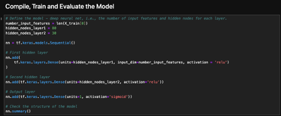
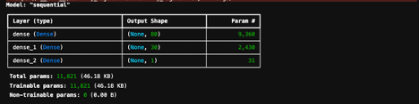
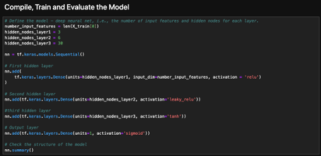
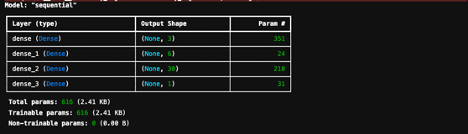
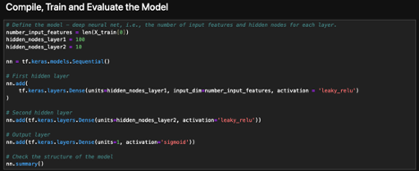
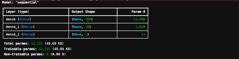
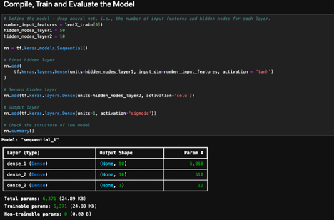
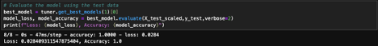

Overview: 

The goal is to use the features in the provided dataset to create a binary classifier that can predict whether applicants will be successful if funded by Alphabet Soup. 

Results: 

Data Preprocessing
What variables are the target for your model? To predict success the target variable is the “is_successful” column. 

What variable are the features of your model? The features of the model are the following columns: “APPLICATION_TYPE”, “AFFILIATION”, “CLASSIFICATION”, “USE_CASE”, “ORGANIZATION”, “STATUS”, “INCOME_AMT”, “SPECIAL_CONSIDERATIONS”, “ASK_AMT”, “SPECIAL_CONSIDERATIONS”, ”ASK_AMT”. 

What variables should be removed from input data because they are neither targets nor features? The variables removed “EIN”, and “NAME”.

Compiling, Training, and Evaluating the Model
How many neurons, layers and activation functions did you select for your neural network model, and why?

The first model there are 2 hidden layers with 80 neurons in the first layer and 30 neurons in the second layer. relu activation was used for both the first layer and the second layer. The sigmoid activation was used for the outer layer. relu is a usual go to because it is a linear function that trains a neural network efficiently.

For the second model I added a third layer and changed the activation function in the second layer to leaky relu, and I used tanh for the third layer. I also reduced the units of the first layer to 3 and the second layer to 6. The units of the third layer are set to 30. Using tanh can minimize anomalies when used in a hidden layer. Using leaky relu was used to help speed up the training process and prevent dying relu. The outcomes were similar to the first model. 

For the third model I reduced the number of layers to 2. Added 100 layers to the first layer and set 10 layers to the second layer. I Used leaky relu for both layers. The outcome was the same. 

The fourth model has two layers with the first layer having 50 units and the second layer having 10 units. The first activation layer uses tanh and the second uses selu for normalization. The outcome was the same.

The fifth model uses a hyperparameter scaler and the outcome is positive. 

